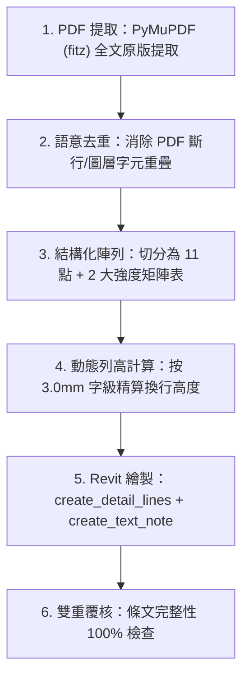

# 都市計畫土地使用管制規則 (Zoning Compliance) 自動排版技能

> **狀態：v0.1-Beta (實驗階段 / 待持續檢討改進)**  
> **核心原則：法規文字 100% 完整原版保留（Verbatim），絕不刪減、截斷、縮寫或妄加個人解釋。**

---

## 📌 1. 技能背景與目標

在台灣建築執照申請與都市計畫檢討圖冊中，「都市計畫土地使用分區管制要點」是建照審查必備的法規圖例。
本技能旨在將公部門發布之「土地使用管制要點 PDF」，透過高精度解析與幾何排版演算法，自動套入 Revit 圖例（Legend）視圖，產出符合事務所出圖標準的三欄式法規檢討大表。

---

## 📐 2. 標準版面幾何規範 (Office Standards)

### 2.1 主表格三大欄寬配置（總寬度 395 mm）

| 欄位名稱 | 標準寬度 (cm / mm) | 對齊方式 | 內容規範 |
| :--- | :--- | :--- | :--- |
| **【法條】** | **1.5 cm (15 mm)** | 置中 / 頂端 | 條號/點次標記（如 `一、`、`二、` ... `十一、`） |
| **【土地使用管制規定】** | **22.0 cm (220 mm)** | 靠左折行 | 100% 原始法定條文、款項目與內嵌強度子表格 |
| **【本案設計檢討】** | **16.0 cm (160 mm)** | 靠左 / 頂端 | 建築師法規檢討說明（如 `本案依規定辦理。`） |
| **合計總外框寬度** | **39.5 cm (395 mm)** | — | **標準施工圖冊出圖圖面規格** |

### 2.2 內嵌土地使用強度子表格配置（總寬度 220 mm）

當條文內含有建蔽率、容積率或公共設施強度管制表時，將其切分為 4 個標準子欄：

* **項目欄**：`55.0 mm`
* **建蔽率(%)**：`25.0 mm`
* **容積率(%)**：`25.0 mm`
* **備註欄**：`115.0 mm`（支援長條款自動折行）
* *合計：$55 + 25 + 25 + 115 = \mathbf{220.0\text{ mm}}$（完全等於 22 cm）*

### 2.3 事務所標準文字規格 (TextNote Styles)

* **大標題**：`小標題4.5mm`（4.5 mm 字級）
* **主表頭欄名**：`小標題3mm` 或 `小標題4.5mm`（3.0 ~ 4.5 mm）
* **條號（一、二...）、內文、單元格內容**：全數嚴格統一採用 **`小標題3mm`（3.0 mm 字級）**

---

## 🔄 3. 標準作業流程 (Workflow)

### 3.1 Step 1：PDF 全文原版無刪減提取
使用 Python `PyMuPDF` 提取文字，過濾掉頁碼浮水印後保留完整法定文字。

### 3.2 Step 2：圖層重疊文字智慧清洗
公部門 PDF 常見斷行重疊（例：`依都市計畫法第 / 市計畫法第22條`），需進行相鄰前綴字串去重，還原通順官方文字。

### 3.3 Step 3：動態列高自適應計算
在 $W = 220\text{ mm}$ 寬度下，每行約可容納 32 ~ 34 個中文字：
$$\text{預估列高 } H = (\text{換行數} + \lceil \text{字數} / 32 \rceil) \times 6.5\text{ mm} + 8.0\text{ mm}$$
確保外框細線劃在最末行文字下方，不壓線、不穿透。

### 3.4 Step 4：Revit MCP 批次繪製
透過 Socket API 批次發送：
1. `create_detail_lines`：繪製水平分隔細線與縱向外框線。
2. `create_text_note`：在精確座標 $(X_i, Y_j)$ 寫入標題、條號、內文與檢討文字。

---

## 🛠️ 4. 相關腳本與資料庫

* **條文資料庫**：[`zoning/verbatim_articles.json`](file:///c:/Users/User/Documents/REVIT_MCP_study/zoning/verbatim_articles.json)
* **PDF 解析腳本**：[`scripts/scratch/build_verbatim_json.py`](file:///c:/Users/User/Documents/REVIT_MCP_study/scripts/scratch/build_verbatim_json.py)
* **Revit 排版生成腳本**：[`scripts/scratch/render_verbatim_complete_zoning.mjs`](file:///c:/Users/User/Documents/REVIT_MCP_study/scripts/scratch/render_verbatim_complete_zoning.mjs)

---

## ⚠️ 5. 待檢討改進與成熟化清單 (Roadmap for v1.0)

目前本技能處於 **v0.1-Beta** 階段，未來需持續檢討與強化的方向如下：

1. **自動跨頁 / 多欄分頁切分 (Pagination)**：
   * 當法規條文總長度超過單一圖紙可容納高度（如 500 ~ 600 mm）時，自動切分為「左半欄 + 右半欄」雙欄式排版，或自動跨圖例生成至 `2_都市計畫2`。
2. **「本案設計檢討」第三欄智慧自動比對**：
   * 讀取 Revit 專案的實際使用分區（如 `第一之一種住宅區`），自動於第二條對應分區填入專案計算數值，其餘非本案分區自動標記 `本案非屬該分區，免檢討`。
3. **C# 插件端 TextNote 原生文字替換支援**：
   * 擴充 Revit C# 插件之 `modify_text_note_content` 指令，支援在既有圖面上「原地直接更換文字內容」，而不需刪除重建。
4. **複雜巢狀附表與圖片圖表支援**：
   * 針對法規中的「附圖（如退縮示意圖、人行步道截角圖）」支援自動截圖並以 Detail Component / RasterImage 插入指定單元格。
