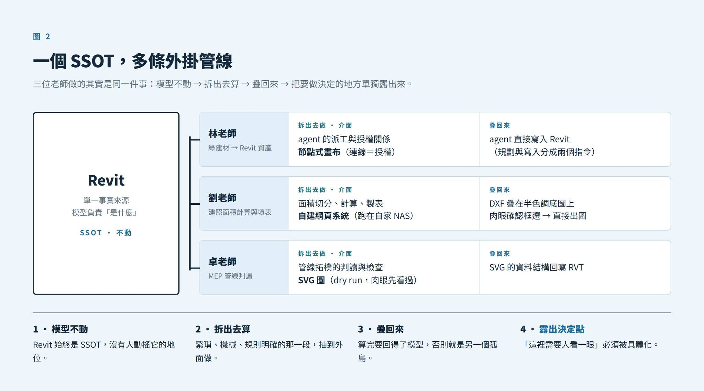

# BIM MCP 八月小聚心得：Revit 只要唯一一份，而介面可以很多

> 作者：黃任遠  
> 主題：BIM MCP 八月小聚心得

## 一、前言

劉可老師超級厲害！！！！！！！！！

聽完這次的 BIM MCP 小聚，我發現大家都開始把自己工作裡的一部分流程，拆出來做成獨立的介面。

不過在講小聚之前，得先倒帶到上一次。聽了鄭慶一執行長的演講，介紹了 illoca 之前的 Tracing Paper 與現在新的 Plamo。Tracing Paper 的想法是用草圖、手寫註記與自然語言取代那一整排按鈕，讓 AI 即時把設計意圖轉成 2D 圖面與 3D 模型；Plamo 則是瀏覽器裡的 agentic 3D 建模工作區，把草圖、參考圖、圖面與自然語言變成可以繼續編輯的幾何。

會後和開方老師去和鄭執行長進一步請教「怎麼看 AEC／BIM 的未來」。當時鄭執行長提出一個未來暢想：未來大家在同一個工具或介面裡面完全整合，讓 Agent 自行決定調用背後的工具（Revit、SketchUp、Rhino、AutoCAD 等），使用者根本不需要曉得背後調用了什麼。甚至再往後，可能有一整代人完全不知道自己剛剛用到了 Revit。

這個未來很值得期待。但理想到之前，日子還是一天一天在過。在「單一介面完全整合」這個理想到達之前，組織內部要怎麼學會這種工作拆分，就變得非常關鍵。

然後就去了這場 BIM MCP 八月小聚。

## 二、大家好像都開始做介面了

三位老師的題目完全不同，一個做綠建材、一個做建照、一個做機電管線，但做法都指向同一件事：把自己工作裡的一段流程，拆出來做成獨立的介面。

以往我們用 Notion，希望全團隊都能直接操作，但總是有些人跟得上、有些人跟不上。對不熟的人，就需要拆出一個更單純的介面，甚至客製一個第三方表單，填完自動進 Notion，連 Notion 都不用開。

以往可能會覺得所有人都要努力學習並熟悉同一套工具，但現在變成：針對不同的職責，操作不同程度的功能，甚至切分出另一個軟體或更簡單的介面。

### 拆分的用意

組織內部當然應該要有良好的 BIM 教育訓練，讓大家能夠熟悉。但與外部單位合作就很需要磨合。

不過，因為 AI 技術可以突破這個流程，我們就可以把需要提供資訊的部位拆分出去，讓其他外部單位都能用自己熟悉的方式、軟體來提供資訊。Revit → Excel → Revit 這條路只要跑得通，就可以拆出去給技師填寫設備資訊，不需要每個人都站在同一個軟體裡。

## 三、林老師：把 agent 做事的過程，變成看得見的節點

林老師開發的專案，主要是把綠建材平台的資訊（從 TABC 官網讀取），轉換為 Revit 的複層牆與樓板資產。

整條鏈路是這樣走的：TABC 官網抓資料（`/GM_update`）→ 產出一個整合平台讓人挑產品（`/GM_web`）→ 生成元件腳本（`/GM_import`，只規劃、不寫入）→ 真正注入 Revit（`/GM_inject revit`）。

注意這裡已經藏了一個拆分：「規劃」與「寫入」是兩個獨立的指令。要挑材料的人在網頁上勾選，agent 產生腳本，最後才有一個明確的、會動到模型的動作。現場實測跑完，Revit 的 Project Browser 裡多出五個新的 Floor Type，而且 agent 誠實回報「Type 已建立，尚未套用到任何實例」。這句話本身就是介面設計的一部分。

不過我覺得最有意思的，是他後來的延伸。

### 從終端機到節點畫布

他分享了一個叫 GT-Office 的東西，是 GitHub 上的開源專案（Apache-2.0），可以同時管 Claude Code、Codex CLI、Gemini CLI 的多 agent 工作區。

他把這個上游進一步改造成節點式（node-based）的 agent workflow 介面：讓 agent 做事的動作變成真實的節點式流程，方便人類理解。

用過 Grasshopper 或 Dynamo 的人，對這種節點式介面一定不陌生。

在 AI agent 還沒大流行之前，大家可能會去學 n8n，那完全是用節點去做這件事，所有邏輯攤在畫布上，但也可能因學習曲線陡峭望而卻步。到了 AI Agent 時代，反而變成完全都看不到了：你丟一句話，它跑一堆事，你只能看結果。

林老師做的這件事，就是在中間找到一個甜蜜點：保留了節點的可見性，但節點裡裝的是有判斷力的 agent。它讓「誰可以叫誰做事」這件原本藏在 prompt 裡的授權關係，變成畫布上一條你必須親手畫出來的線。

這也有點像現在 ComfyUI 復興。以往的 ComfyUI 可能要從頭、或者從範本一段一段重新接，很多除錯的部分（像是大模型有問題、Embedding 有問題，以及各式各樣不知道該怎麼辦的問題）都需要自己去 debug（然後做不出來只好跟松音求救～～～）。有了 AI Agent 之後，很大程度幫大家省下了除錯的時間，也讓 ComfyUI 的節點式操作又變得重要了。

## 四、劉老師：把整條建照流程抽出來，變成獨立的系統

劉老師（之物建築 THINKLAB）在實務建築中，幾乎已經把建築師事務所做建照的一個完整流程拆解出來了。建照面積計算與填表系統大家現場都看到，劉老師真的做得太完整了。

### 痛點

六十九棟集合住宅要畫六十九張建照。（大家嚇瘋）

一張建照要交四樣東西，每一棟都要各做一份：面積分割圖（矩形＋三角形切割、標尺寸）、面積計算式表（每列印出計算式供人工手算對照）、建築概要表（建蔽率／容積率／收容人數／圍牆造價）、各戶總表。

### 舊路線：Grasshopper inside Revit

他們很早就用 Grasshopper 來做建照面積的切分程式，然後用 Rhino.Inside.Revit 來跑，曲面／異形量體還能自動產生分割線與角度標註。

但過去的做法是：Revit 模型匯出後跑一遍 Grasshopper 腳本，再導出到計算表並進行人工核對，中間多了好幾個人工步驟。已經很自動化了，但還是有許多機械性的重工。

### 新路線：模型負責「是什麼」，外面負責「算成什麼」

把 Revit 當成 SSOT（單一事實來源），然後把整條建照流程拆出去：模型資料匯出後，獨立自建一套網頁系統（跑在事務所自己的 NAS 上，二十幾個自建工具彼此可以互連），把整個建照流程變成獨立的 Web 介面。

實際的步驟是這樣編號的：STEP00 匯入模型 → STEP01 面積分割圖（輸出 DXF）→ STEP02 面積計算式表（CSV）→ STEP03 建築概要表 → STEP05 尺寸標註編輯。（STEP04 自動二維填表還在開發中，是唯一未完成的一環。）

處理完之後再重新套疊回 Revit：圖紙中直接用半色調（Half Tone）顯示底圖，把系統匯出的 DXF 建照面積切分圖疊合在上面。這樣一來就不需要人工逐一核對，而是已經被整理好的狀態，人用肉眼就能直接確認框選範圍正不正確。

而且做到了最後一哩路：可以直接 `Ctrl+P` 出圖，不用後加工。

### 把差異框出來，讓人眼直接看

系統裡有一個叫 DrawReview 的工具。它做的事不是「幫你判斷對錯」，而是把兩份文件對不上的地方框出來，排好版擺在你面前：哪幾格數字不一致、差多少、為什麼會差，一眼看完。

現場示範的案例是三格造價概算因為進位方向不同，各差 1 元。一元的落差在建照審查裡就是退件的理由，而這種錯誤人是抓不完的。但真正省事的地方不在「AI 算出來了」，在於它把那三格圈起來，人只要看一眼就知道該不該改。

這扣合之前小聚邵老師提過的一件事：把需要檢查判斷的事情，做成人方便檢查、排好版的樣子就好，不用走火入魔到全部都要 AI 百分之百做判斷。

判斷留給人，排版交給機器。這個分工比「全自動」實際得多。

還有一個他反覆強調的設計決策：自洽優先，面積欄的值取「計算式手算出來的值」，因為審查者是拿印出來的算式去對面積欄的。系統的正確性定義，是照著使用者（審查者）的動作來定的，不是照著數學。

一年半前我 PO 的 Revit → Excel → Revit 流程，機電技師只要將 Excel 裡的各空間面積、窗面積等資訊填入；填寫完表格或設備規格後，設計單位再把資訊填回 Revit。後來這段流程變得很自動化，技師根本不需要會開 Revit 的 Schedule，只要收到 Excel、填完送回，就能自動匯入。

背後的核心思想完全一樣：把不同負責人與他擅長的軟體或介面直接拆開，不需要所有人都會同一套工具。

劉老師也提到，這樣做完全跳脫了以前 Revit 的版本問題。一旦拆分開來：

- 建模的人可以專心在 Revit 裡建模；
- 確認建照圖的人可以在自建的系統中專注處理，甚至不需要開啟 Revit。

這也是未來事務所非常關鍵的能力。把工作流程徹底拆開，明確劃分哪一段專注用 Revit、哪一段用專屬工具。重點在於透過 AI Agent 進行拆分，避免人類重複進行機械性的謄寫與重工。

江 Sir 補一句很重要的話：老闆才知痛點。這整套系統之所以能對準真實工作流的卡點，是因為由事務所負責人親自下班後開發。只有實際天天扛痛點的人，才知道系統該長什麼樣。

## 五、卓老師：先讓人用肉眼看過一遍

他的做法是用 SVG 先把管線系統拆出來，也就是所謂的「可觀測性」。這有點像軟體工程 dry run 的概念：直接把配管關係接上去，先在 SVG 上用肉眼確認。確認好之後，有任何需要調整的地方，可以直接在 SVG 介面上輸入，再重新注入到 Revit 裡面，就不用一開始做錯還很難檢查。

關鍵是這張 SVG 不是單向輸出給人看的預覽圖，它的資料結構本身可以回寫進 Revit。所以又是同一個迴路：模型外部運算 → 疊回模型。

我之前參加李慕約的生成式 AI 年會，他也提到過「可觀測性」的重要性。他做電子報逐字稿也是這樣：每一段 AI 檢核潤飾，介面都會列出改了哪一段、刪了哪一段、哪些沒動過，以及修改前後的對照，讓人自己決定接不接受。

這樣就不會像一般用 AI 對話直接生成整篇文章時，根本看不出前面原本是什麼、改動了哪些。

把需要做決定的地方特別抽離出來，我覺得真的非常關鍵。

## 六、三個案例，其實是同一個結構

三段放在一起，結構是一樣的：

- **林老師**：把 agent 的派工與授權關係拆出去，做成節點畫布，agent 再直接寫進 Revit。
- **劉老師**：把面積切分、計算、製表拆出去，做成自建網頁系統，DXF 疊在半色調底圖上回到圖紙。
- **卓老師**：把管線拓樸的判讀與檢查拆出去，做成 SVG 圖，資料結構再回寫 RVT。

共通的四件事：

1. **模型不動**：Revit 始終是 SSOT，沒有人去改它的地位。
2. **拆出去算**：繁瑣、機械、有明確規則的那一段，抽到外面做。
3. **疊回來**：算完的結果要能回到模型，否則就是另一個孤島。
4. **把要做決定的地方單獨露出來**：不管是節點畫布上的連線、紅框標出的異常區塊，還是 SVG 上的一條管路，都是「這裡需要一個人來看一眼」的具體化。

第四點很關鍵。自動化的難處從來不是「怎麼算」，而是「算完之後人要怎麼相信它」。

## 七、這個想法已經有名字：漸進式揭露

這件事其實不是新的，只是被搬到了新的地方。

漸進式揭露（Progressive Disclosure）這個概念，是 Jakob Nielsen 在 1995 年提出的 UX 設計原則（Apple 的 Macintosh Human Interface Guidelines 早在 1992 年就有專節在講）。原意很簡單：把進階或罕用的功能延後到次級畫面，讓應用更好學、更不容易出錯。

我第一次認真接觸這個詞，其實是在討論 AI 的 skill 設計的時候，Anthropic 的 Agent Skills 官方文件把 progressive disclosure 明講為核心設計原則，分成三階段載入：

1. **Discovery**：啟動時只知道每個 skill 的名稱與描述，不載入內容；
2. **Activation**：需求命中某個描述，才把整份 `SKILL.md` 讀進 context；
3. **Execution**：文件裡指向的其他檔案，只讀這次任務真的用得到的。

目的是省 context：不要一次把所有東西塞給模型。

這次小聚讓我看到的，是把這個概念再具體落實於 AEC 公司治理，例如用到整個事務所的工作流程上。

- **Jakob Nielsen（1995）**：UI 對使用者揭露，把進階功能延後到次級畫面。
- **Anthropic Agent Skills**：Skill 對模型揭露，三階段載入，省 context。
- **到這篇**：對事務所裡的每個角色揭露，依職責露出該做的決定，其餘收起來。

## 八、Agent = Model + Harness，那事務所呢？

DeepSeek 開源了一個叫 deepseek-harness 的 agent 框架，架構主張是「everything is a plugin」：模型、工具、workflow、連 UI 都是可插拔的模組。

它背後的公式是：

> **Agent = Model + Harness**

模型提供智力，但 harness 決定它實際上做得到什麼：它看得到什麼、能用哪些工具、怎麼拆解任務、怎麼管理記憶。

裡面有幾個設計，跟這次小聚看到的東西幾乎是同構的：

- **Trajectory**：完整的執行軌跡記錄，可觀測性堪比瀏覽器的開發者工具。→ 這就是卓老師的 SVG dry run、李慕約的 diff 對照、林老師的節點畫布。
- **Agent Teams**：持久化的協作結構，有共享的任務管理。→ 這就是「誰可以叫誰做事」那條必須手畫的連線。
- **UI 也是 plugin**：介面是可替換的模組，不是系統的固定外殼。→ 這就是「同一份模型，可以掛不同的介面」。

它們是一體兩面：同一個 SSOT 上，往模型的方向長出 harness，往人的方向長出分層介面。甚至可以說，一間事務所自己就是自己的 harness，它決定了每個人看得到什麼、能用哪些工具、任務怎麼拆、經驗怎麼留下來。

### 回到「單一介面完全整合」的設想

所以再回頭看「單一介面完全整合」的設想，那個終局如果真的到來，它到來的方式大概就是「harness 強到讓你感覺不到自己在切換軟體」。

而在那之前，Revit 只要一份，介面可以有很多個。

把流程拆對、把該做決定的地方做成好讀的介面、把算完、確認完的東西疊回去。這件事現在就能開始做，而且做得越早，之後應該越能接得上那個終局吧（？）
