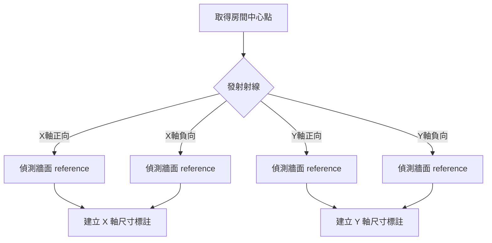

# 自動標註與柱心間距標準工作流程

## 📋 概述

本工作流程定義了 Revit 建築平面圖自動標註的兩大核心體系：
1. **柱間距與柱心連續標註（Grid Column Dimensioning SOP）**：外圍柱列與總長連續標註。
2. **空間與物件自動標註（Ray-Casting / Wall-Batch）**：房間淨尺寸、走廊寬度與設備淨空檢討。

---

## 🔍 零、標註型式前置查詢與降級防呆規範 (Preflight DimensionType Check - 必做)

1. **嚴禁寫死 TypeId**：任何標註指令執行前，禁止寫死靜態 ElementId（如 `2240793` / `2240801`）。
2. **動態查詢**：先呼叫 `query_elements` (`category: "DimensionTypes"`) 讀取專案可用清單。
3. **多階匹配原則**：
   - 優先尋找名稱包含 `柱心-上右`（頂部/東側）或 `柱心-下右`（底部/西側）之專屬型式。
   - 若專案未包含 TABC 樣板，模糊匹配包含 `柱心`、`對齊` (Aligned)、`Linear` 等線性型式。
   - 若仍無，回退至專案第一支可用線性型式或不傳 typeId，並明確警示使用者。

---

## 🏛️ 一、柱間距標註標準作業程序（Grid Column Dimensioning SOP）

### 1. 雙層同一線段連續串接標註（String Dimension）
- 標註圖元必須為單一連續標註實體（`SegmentsCount >= 2`），點選時為一整條連續線，嚴禁分開。
- **外層（第 1 層）**：全棟或各翼跨度總長標註。
- **內層（第 2 層）**：柱心連續間距標註（同一線段串接所有柱心）。

### 2. 純原生 Grid 軸線參照（0 條輔助短細線）
- 必須透過 `gridIds: [ ... ]` 傳入原生 `Grid` 軸線圖元參照。
- 嚴禁在圖面上建立 DetailLines 輔助線。

### 3. 標註型式（Dimension Type）規範
- **上方（北側）與 右側（東側）**：優先採用 **`TABC-DIM_*/ S 2.5-柱心-上右`**（動態解析 ID）
- **下方（南側）與 左側（西側）**：優先採用 **`TABC-DIM_*/ S 2.5-柱心-下右`**（動態解析 ID）

### 4. 繪製起訖方向與輔助線延伸指向（100% 朝向建物內側）
| 方位 | 尺寸基準線起訖方向 | 輔助線延伸指向 | 標註型式 (Dimension Type) |
|:---|:---:|:---:|:---|
| **北側 (上方)** | **由右至左**（東向西: A $\to$ G） | ⬇️ **朝下（指向建物）** | `TABC-DIM_*/ S 2.5-柱心-上右`（動態 ID） |
| **東側 (右側)** | **由下至上**（南向北: 5 $\to$ 7） | ⬅️ **朝左（指向建物）** | `TABC-DIM_*/ S 2.5-柱心-上右`（動態 ID） |
| **南側 (下方)** | **由左至右**（西向東: G $\to$ D） | ⬆️ **朝上（指向建物）** | `TABC-DIM_*/ S 2.5-柱心-下右`（動態 ID） |
| **西側 (左側)** | **由上至下**（北向南: 7 $\to$ 1） | ➡️ **朝右（指向建物）** | `TABC-DIM_*/ S 2.5-柱心-下右`（動態 ID） |

### 5. 5MM 三等距階梯鎖點規範
依出圖比例（1:100 時 1mm = 100mm 模型空間）：
- **外層線（第 1 層）**：距離軸線圓圈底 **`5.0 mm`**（模型空間 $500\text{ mm}$）。
- **內層線（第 2 層）**：距離外層線 **`5.0 mm`**（符合型式參數 `尺寸線鎖點距離: 5.0000 mm`，模型空間 $500\text{ mm}$）。
- **端點輔助線（第 3 層）**：向內延伸 **`5.0 mm`**（符合型式參數 `輔助線長度: 5.0000 mm`，模型空間 $500\text{ mm}$）。

---

## 🔧 二、房間與設備射線標註流程 (Ray-Casting)

### 關鍵參數
* **Origin**: 射線起點 (Room Location Point)。
* **View**: 目標視圖 (必須是平面圖)。
* **TargetCategory**: 偵測目標 (BuiltInCategory.OST_Walls)。

---

## ⚠️ 限制與注意事項
1. **3D 視圖限制**：嚴禁在 3D 視圖中建立 2D 平面標註。
2. **柱心標註統一規範**：所有後續柱心/柱間距標註工作必須 100% 依循上述 SOP 執行。

---
**維護者：** RevitMCP Team
